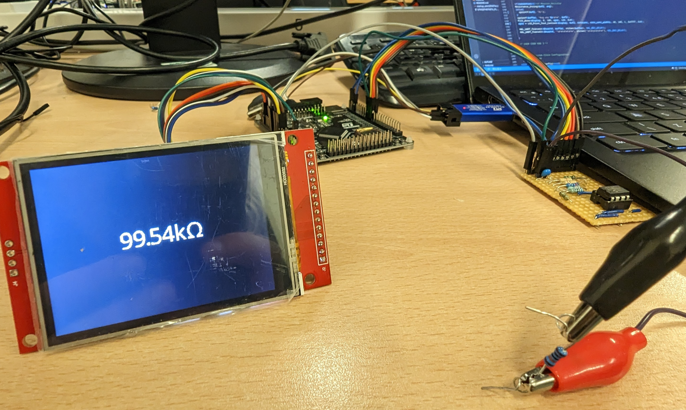
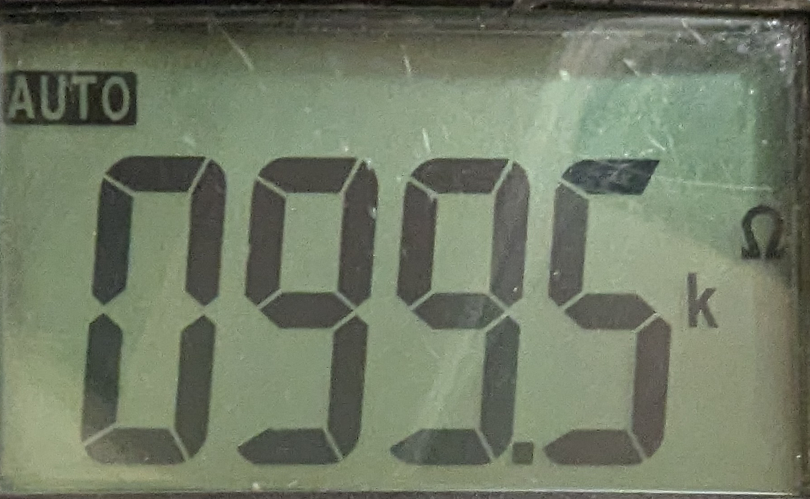

# The code for the component tester
## This is the STM32CubeMX project for the component tester. It can be compiled using the makefile, then uploaded to the STM32 with 
`st-flash --reset write build/SPI-TEST.bin 0x8000000`

### The operation of the tester is very simple. It uses several reference resistors, each connected to a GPIO pin on one side, and the component to be tested on the other - like so:

### This schematic was built up on a piece of stripboard, using the MCP6022 op-amp (MCP6021 would also work). 

### This yielded some surprisingly accurate results, especially considering the poor reference resistor choice.

### Here is the measurement of a 100kΩ resistor

### Compare that to a calibrated DMM:

### Pretty good!

### Sadly, the tester is currently only able to measure resistors. The circuit is theoretically capable of measuring capacitors by charging them through the reference resistors and measuring time taken to reach a specific value. This part of the code is currently not working and requires some fixes.

### The code also contains a basic display library I wrote for the ILI9341 based IPS panel used in the project, as well as a touch library for the XPT2046 touch IC. This should allow us to add some extra features as well as pretty graphics to the display.